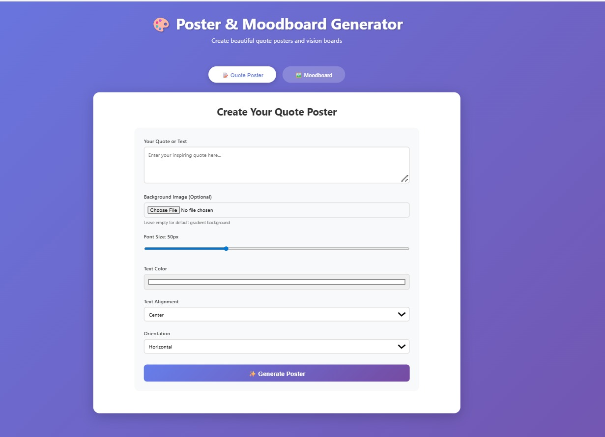
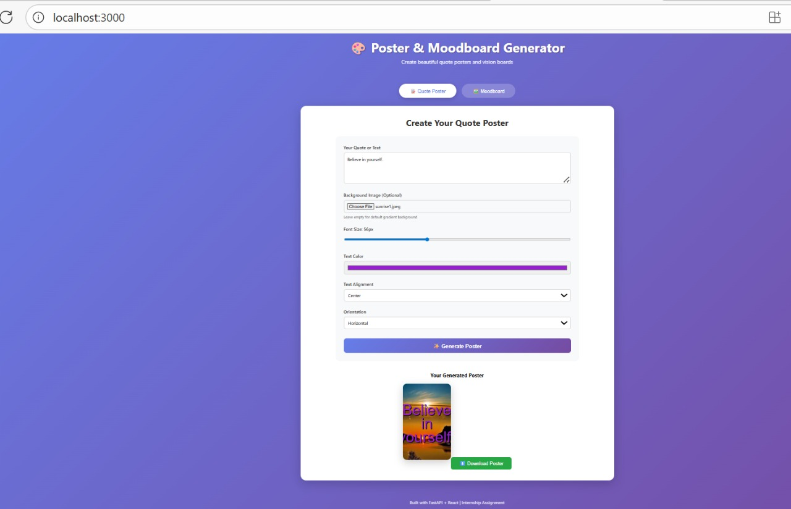
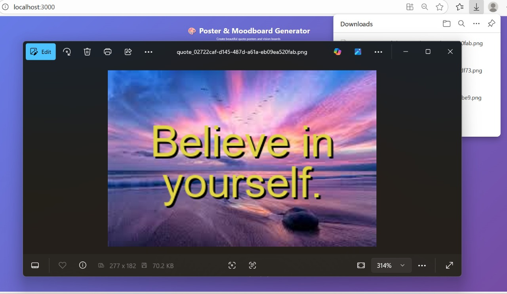
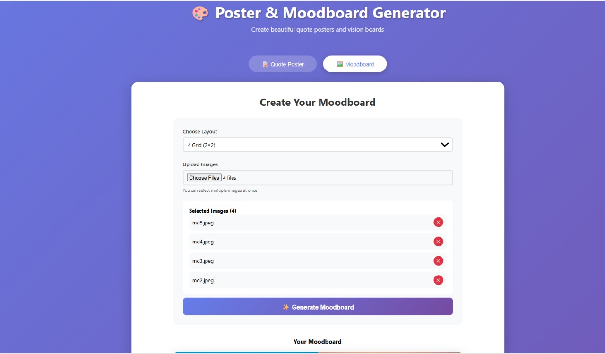
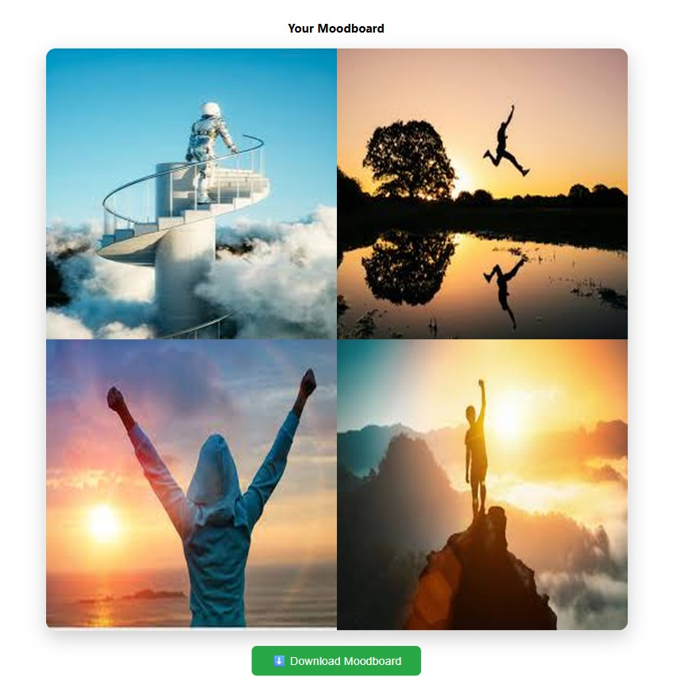

# 🎨 Poster & Moodboard Generator

A full-stack web application for creating custom quote posters and vision boards with intelligent image processing capabilities.



## 🌟 Live Demo Features

### 1️⃣ Manual Quote Poster Generator
Create beautiful quote posters with customizable text overlays on backgrounds.



**Features:**
- ✨ Custom text input with auto-wrapping
- 🖼️ Upload custom backgrounds or use default gradients
- 🎨 Full typography control (font size, color, alignment)
- 📐 Horizontal and vertical orientations
- ⬇️ High-quality PNG download



### 2️⃣ Manual Moodboard/Vision Board Generator
Create collages and vision boards with multiple images in various grid layouts.



**Features:**
- 📊 5 different grid layouts (4, 8, 16 cells)
- 🖼️ Multi-image upload support
- 🎯 Automatic grid positioning and resizing
- 📱 Portrait and landscape orientations
- ⬇️ Download as single image



---

## 🛠️ Tech Stack

**Backend:**
- **FastAPI** - Modern Python web framework
- **Pillow (PIL)** - Image processing and manipulation
- **Uvicorn** - ASGI server for production

**Frontend:**
- **React.js** - Component-based UI framework
- **Axios** - HTTP client for API communication
- **CSS3** - Modern styling with gradients and animations

---

## 📁 Project Structure

```
poster-generator/
├── backend/
│   ├── main.py                 # FastAPI application with all endpoints
│   ├── requirements.txt        # Python dependencies
│   ├── uploads/               # User uploaded images
│   ├── backgrounds/           # Background image collection
│   └── outputs/               # Generated posters and moodboards
│
└── frontend/
    ├── package.json           # Node.js dependencies
    ├── public/
    └── src/
        ├── App.js             # Main application component
        ├── App.css            # Global styles
        ├── components/
        │   ├── QuotePoster.js      # Quote poster generator
        │   ├── QuotePoster.css
        │   ├── Moodboard.js        # Moodboard generator
        │   └── Moodboard.css
        └── index.js           # React entry point
```

---

## 🚀 Installation & Setup

### Prerequisites
- Python 3.8 or higher
- Node.js 14 or higher
- npm or yarn

### Backend Setup

1. **Navigate to backend directory:**
```bash
cd backend
```

2. **Create virtual environment:**
```bash
python -m venv venv
```

3. **Activate virtual environment:**

**Windows:**
```bash
venv\Scripts\activate
```

**Mac/Linux:**
```bash
source venv/bin/activate
```

4. **Install dependencies:**
```bash
pip install -r requirements.txt
```

5. **Start the server:**
```bash
uvicorn main:app --reload
```

Server will run at: `http://localhost:8000`

### Frontend Setup

1. **Navigate to frontend directory:**
```bash
cd frontend
```

2. **Install dependencies:**
```bash
npm install
```

3. **Start development server:**
```bash
npm start
```

Application will open at: `http://localhost:3000`

---

## 📖 API Documentation

Once the backend is running, access interactive API docs:
- **Swagger UI:** http://localhost:8000/docs
- **ReDoc:** http://localhost:8000/redoc

### Main Endpoints

#### `POST /generate-quote-poster`
Generate a quote poster with text overlay.

**Parameters:**
- `text` (string) - Quote text to overlay
- `font_size` (int) - Font size in pixels (20-120)
- `color` (string) - Text color in hex format
- `alignment` (string) - left, center, or right
- `orientation` (string) - horizontal or vertical
- `background_file` (file, optional) - Upload custom background

**Response:**
```json
{
  "success": true,
  "filename": "quote_abc123.png",
  "download_url": "/download/quote_abc123.png"
}
```

#### `POST /generate-moodboard`
Create a moodboard from multiple images.

**Parameters:**
- `layout` (string) - Grid layout (4x4, 8-grid, 16-grid, portrait-8, portrait-16)
- `files` (array) - Multiple image files

**Response:**
```json
{
  "success": true,
  "filename": "moodboard_xyz789.png",
  "download_url": "/download/moodboard_xyz789.png"
}
```

#### `GET /download/{filename}`
Download generated images.

#### `POST /upload-background`
Upload background images for later use.

#### `GET /backgrounds`
List all available background images.

---

## 💡 Usage Guide

### Creating a Quote Poster

1. Open the application in your browser
2. Click on **"Quote Poster"** tab
3. Enter your text or quote
4. (Optional) Upload a background image
5. Customize:
   - Adjust font size using the slider
   - Pick text color from color picker
   - Select alignment (left/center/right)
   - Choose orientation (horizontal/vertical)
6. Click **"Generate Poster"**
7. Download your creation

### Creating a Moodboard

1. Click on **"Moodboard"** tab
2. Select your desired layout from dropdown
3. Click **"Upload Images"** and select multiple images
4. Review selected images (remove any if needed)
5. Click **"Generate Moodboard"**
6. Download your vision board

---

## 🎨 Key Features Explained

### Quote Poster Text Processing

The backend implements intelligent text wrapping:
- Automatically splits long text into multiple lines
- Calculates optimal line breaks based on image width
- Centers text vertically on the image
- Adds shadow effect for better readability

### Moodboard Grid System

Layout calculation algorithm:
```python
# Calculate position in grid
row = index // columns
col = index % columns
x = col * cell_width
y = row * cell_height
```

Each image is:
- Resized to fit cell dimensions
- Positioned at calculated coordinates
- Pasted onto the canvas maintaining aspect ratio

---

## 🔧 Technical Implementation

### Image Processing (Pillow)

**Text Overlay:**
```python
def add_text_to_image(image, text, font_size, color, alignment, orientation):
    # Rotate if vertical
    # Calculate text wrapping
    # Position text based on alignment
    # Draw text with shadow effect
    return processed_image
```

**Moodboard Creation:**
```python
def generate_moodboard(layout, images):
    # Create blank canvas
    # Calculate grid dimensions
    # Resize and position each image
    # Paste onto canvas
    return final_moodboard
```

### Frontend State Management

React components use `useState` hooks for:
- Form inputs (text, colors, alignment)
- File uploads (backgrounds, multiple images)
- Loading states during processing
- Generated image URLs for display

### CORS Configuration

Backend enables CORS for frontend communication:
```python
app.add_middleware(
    CORSMiddleware,
    allow_origins=["http://localhost:3000"],
    allow_credentials=True,
    allow_methods=["*"],
    allow_headers=["*"],
)
```

---

## 🎯 Future Enhancements

### Phase 2 Features (Roadmap)

**Quote Poster:**
- [ ] AI-powered background generation using Stability AI
- [ ] Background collection gallery with thumbnails
- [ ] User system for liked/starred pictures
- [ ] Multiple font selection (Google Fonts integration)
- [ ] Text effects (bold, italic, underline)
- [ ] Image filters and effects

**Moodboard:**
- [ ] Text support in individual cells
- [ ] Video thumbnail support
- [ ] Drag-and-drop interface for cell arrangement
- [ ] Complex asymmetric layouts
- [ ] Per-cell editing and customization
- [ ] Template library

**Infrastructure:**
- [ ] User authentication and profiles
- [ ] Database integration (PostgreSQL)
- [ ] Cloud storage (AWS S3)
- [ ] Share functionality (social media integration)
- [ ] Project history and save functionality

---

## 🐛 Troubleshooting

### Backend Issues

**Error: "No module named 'PIL'"**
```bash
pip install Pillow
```

**Error: "Port 8000 already in use"**
```bash
# Kill the process or use different port
uvicorn main:app --reload --port 8001
```

### Frontend Issues

**Error: "CORS policy blocked"**
- Ensure backend is running on port 8000
- Check CORS middleware configuration in `main.py`
- Verify frontend is accessing `http://localhost:8000`

**Error: "Module not found: QuotePoster"**
- Ensure `components/` folder exists in `src/`
- Check file names are correct (case-sensitive)
- Run `npm install` again

### Image Processing Issues

**Error: "Font not found"**
- App uses fallback default font if system fonts unavailable
- For custom fonts, update font path in `get_font()` function

**Error: "Invalid image format"**
- Only PNG, JPEG, JPG formats supported
- Ensure uploaded files are valid images

---

## 📦 Dependencies

### Backend (requirements.txt)
```
fastapi==0.104.1
uvicorn==0.24.0
python-multipart==0.0.6
Pillow==10.1.0
python-dotenv==1.0.0
```

### Frontend (package.json)
```json
{
  "dependencies": {
    "react": "^18.2.0",
    "react-dom": "^18.2.0",
    "axios": "^1.6.0"
  }
}
```

---

## 🚀 Deployment

### Backend Deployment (Render/Railway/AWS)

1. **Prepare for production:**
```bash
# Update requirements.txt
pip freeze > requirements.txt

# Add Procfile
echo "web: uvicorn main:app --host 0.0.0.0 --port $PORT" > Procfile
```

2. **Environment variables:**
- Set `CORS_ORIGINS` to your frontend URL
- Configure file storage paths

### Frontend Deployment (Vercel/Netlify)

1. **Build production bundle:**
```bash
npm run build
```

2. **Update API URL:**
- Change `API_URL` in components to production backend URL

3. **Deploy:**
```bash
# Using Vercel CLI
vercel --prod

# Or using Netlify CLI
netlify deploy --prod
```

---

## 🧪 Testing

### Manual Testing Checklist

**Quote Poster:**
- [ ] Enter text and generate with default background
- [ ] Upload custom background and generate
- [ ] Test all alignments (left, center, right)
- [ ] Test vertical orientation
- [ ] Try different font sizes and colors
- [ ] Verify download works
- [ ] Test with very long text (wrapping)

**Moodboard:**
- [ ] Test each layout option
- [ ] Upload 2-16 images
- [ ] Remove images from selection
- [ ] Generate and verify grid layout
- [ ] Verify download works
- [ ] Test with different image sizes

---

## 📝 Assignment Notes

This project was developed as an internship assignment for **Deckoviz Space Labs** - Python Backend & AI Intern position.

**Assignment Requirements Completed:**
- ✅ Manual quote poster generator with text overlay
- ✅ Background upload functionality
- ✅ Typography customization (size, color, alignment, orientation)
- ✅ Manual moodboard generator with multiple layouts
- ✅ Multi-image upload and grid arrangement
- ✅ Production-ready FastAPI backend
- ✅ React frontend with modern UI
- ✅ Error handling and validation

**Technologies Demonstrated:**
- Python backend development with FastAPI
- Image processing with Pillow
- RESTful API design
- React component architecture
- State management
- File upload handling
- CORS configuration
- Clean code practices

---

## 👨‍💻 Author

**Shiwani Raj**
- 📧 Email: shiwaniraj203@gmail.com
- 💼 Position: Python Backend & AI Intern Applicant
- 🏢 Company: Deckoviz Space Labs

---

## 📄 License

This project was created as an internship assignment. All rights reserved.

---

## 🙏 Acknowledgments

- **Deckoviz Space Labs** for the internship opportunity
- **FastAPI** for excellent Python framework and documentation
- **React** community for comprehensive guides
- **Pillow** for powerful image processing capabilities

---

## 📞 Support

For questions or issues:
1. Check the troubleshooting section above
2. Review API documentation at `/docs`
3. Contact: shiwaniraj203@gmail.com

---

**Built with ❤️ using FastAPI + React | **